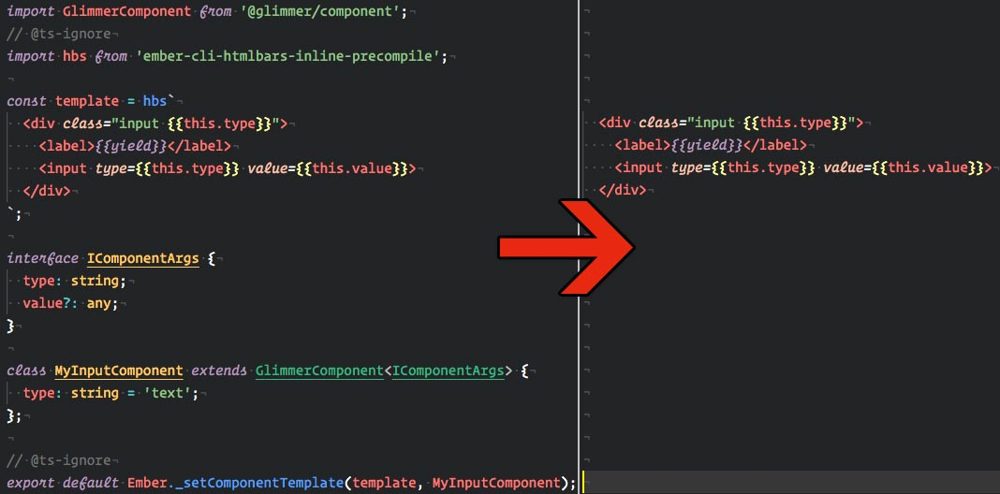

Extract tagged template literals
==============================================================================

Search and extract tagged template literals from javascript/typescript file.


Installation
------------------------------------------------------------------------------

```bash
yarn add extract-tagged-template-literals
```

Usage
------------------------------------------------------------------------------
It's possible to use more than one tag via the `|` (regex **or** separator), valid tags:
 - `hbs`
 - `hbs|handlebars`
 - `hbs|handlebars|dotted.string`
 
```ts
searchAndExtract(documentContent: string, tag: string): string;
// or the hbs wrapper
searchAndExtractHbs(documentContent: string): string;
```
 
### Example
```ts
import { searchAndExtract } from 'extract-tagged-template-literals';

const tag = 'hbs';
const documentContent = `
  import GlimmerComponent from '@glimmer/component';
  // @ts-ignore
  import hbs from 'ember-cli-htmlbars-inline-precompile';

  const template = hbs\`
    <div class="input {{this.type}}">
      <label>{{yield}}</label>
      <input type={{this.type}} value={{this.value}}>
    </div>
  \`;

  interface IComponentArgs {
    type: string;
    value?: any;
  }

  class MyInputComponent extends GlimmerComponent<IComponentArgs> {
    type: string = 'text';
  };

  // @ts-ignore
  export default Ember._setComponentTemplate(template, MyInputComponent);
`;

const extractedTaggedTemplateLiterals = searchAndExtract(documentContent, tag);
console.log(extractedTaggedTemplateLiterals);
```
Output:
```hbs
                                                    
               
                                                         

                       
    <div class="input {{this.type}}">
      <label>{{yield}}</label>
      <input type={{this.type}} value={{this.value}}>
    </div
```

### Full example
```ts
import { searchAndExtract } from 'extract-tagged-template-literals';
const tag = 'hbs|handlebars|dotted.string';
const documentContent = `import GlimmerComponent from '@glimmer/component';
  // @ts-ignore
  import hbs from 'ember-cli-htmlbars-inline-precompile';

  const template = hbs\`
    <div class="input {{this.type}}">
      <label>{{yield}}</label>
      <input type={{this.type}} value={{this.value}}>
    </div>
  \`;

  const myButtonTemplate = handlebars\`<button type="button">{{yield}}</button>\`;

  interface IComponentArgs {
    type: string;
    value?: any;
  }

  class MyInputComponent extends GlimmerComponent<IComponentArgs> {
    type: string = 'text';
    layout = dotted.string\`This is just an example with **dotted.string** as a tag name and **escaped backtick** char \\\` inside the literal template \`;
  };

  // @ts-ignore
  export default Ember._setComponentTemplate(template, MyInputComponent);
`;
const extractedTaggedTemplateLiterals = searchAndExtract(documentContent, tag);
console.log(extractedTaggedTemplateLiterals);
```
Output:
```hbs
                                                    
               
                                                         

                       
    <div class="input {{this.type}}">
      <label>{{yield}}</label>
      <input type={{this.type}} value={{this.value}}>
    </div>
    

                                      <button type="button">{{yield}}</button>  

                            
                 
                
   

                                                                   
                          
                           This is just an example with **dotted.string** as a tag name and **escaped backtick** char \` inside the literal template  
```

Contributing
------------------------------------------------------------------------------

### Installation

* `git clone <repository-url>`
* `cd extract-tagged-template-literals`
* `yarn install`

### Linting

* `yarn lint`

### Running test

* `yarn test`

